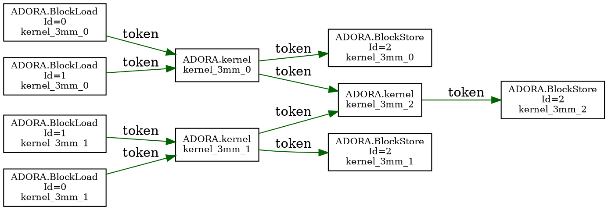

# ADORA 编译流水线详解：Token、Dump 与完整示例

> 更新时间：2026-05-17  
> 示例基于 `experiment/taskschedule/` 目录中的真实测试用例  
> 重点：每一步 IR 长什么样、token 怎么流动、stream 着色如何在 emit 内完成、dump 怎么用

---

## 0. 读前须知：三个核心对象

在阅读流水线之前，先理解三个贯穿始终的核心对象：

### `!ADORA.token`
一种 MLIR SSA 值类型，表示"某个异步操作的完成凭证"。  
谁产生它：`ADORA.BlockLoad async` / `ADORA.kernel async` 的返回值。  
谁消费它：后继 op 的 `asyncDependencies` 列表（`async [%tok_a, %tok_b, ...]`）。  
语义：消费者必须等待所有 token 的产生者完成，才能开始执行。

```mlir
// 产生 token
%result, %tok0 = ADORA.BlockLoad %A [0, 0] : ... -> !ADORA.token

// 消费 token（等 tok0 完成才启动 kernel）
%kernel_tok = ADORA.kernel async [%tok0] { ... } -> !ADORA.token
```

### `adora.dep_summary`
挂在 `func.func` 上的 ArrayAttr，序列化了任务图中所有 DataBlock 级依赖边。  
在 `--adora-schedule-tasks` 运行时写入，在 `EmitPytest`（Path 2）中读回。  
格式：`{src=id_a, dst=id_b, kind="RAW"|"WAR"|"WAW", overlap=true}`

### `tokens.dot`
GraphViz dot 格式的 token 依赖图可视化文件，由 `dump-token-graph=<路径>` 参数产生。  
包含 BlockLoad（蓝色）、BlockStore（红色）、kernel（黄色）节点以及 token 边（绿色箭头）。

---

## 1. 起点：Stage 2 输出的 `_opt.mlir`

这是 task-schedule 的**输入**。以 **3mm（三矩阵乘）** 为例：

```
A × B = E    (kernel_3mm_0)
C × D = F    (kernel_3mm_1)
E × F = G    (kernel_3mm_2)
```

`_opt.mlir` 在 schedule-tasks 运行之前长这样（已有 BlockLoad/Store，**无 token**）：

```mlir
module {
  func.func @kernel_3mm(%A: memref<?x20xf32>, %B: memref<?x18xf32>,
                        %C: memref<?x24xf32>, %D: memref<?x22xf32>,
                        %E: memref<?x18xf32>, %F: memref<?x22xf32>,
                        %G: memref<?x22xf32>) {

    // ── kernel_3mm_0: A × B ──────────────────────────────────────
    %rA = ADORA.BlockLoad %A [0, 0] : ... {Id = "0", KernelName = "kernel_3mm_0"}
    %rB = ADORA.BlockLoad %B [0, 0] : ... {Id = "1", KernelName = "kernel_3mm_0"}
    %lm_E = ADORA.LocalMemAlloc memref<16x18xf32> {Id = "2", KernelName = "kernel_3mm_0"}
    ADORA.kernel { ... } {KernelName = "kernel_3mm_0"}
    ADORA.BlockStore %lm_E, %E [0, 0] : ... {Id = "2", KernelName = "kernel_3mm_0"}

    // ── kernel_3mm_1: C × D ──────────────────────────────────────
    %rC = ADORA.BlockLoad %C [0, 0] : ... {Id = "0", KernelName = "kernel_3mm_1"}
    %rD = ADORA.BlockLoad %D [0, 0] : ... {Id = "1", KernelName = "kernel_3mm_1"}
    %lm_F = ADORA.LocalMemAlloc memref<18x22xf32> {Id = "2", KernelName = "kernel_3mm_1"}
    ADORA.kernel { ... } {KernelName = "kernel_3mm_1"}
    ADORA.BlockStore %lm_F, %F [0, 0] : ... {Id = "2", KernelName = "kernel_3mm_1"}

    // ── kernel_3mm_2: E × F（Buffer Reuse：直接用上面 lm_E, lm_F）──
    %lm_G = ADORA.LocalMemAlloc memref<16x22xf32> {Id = "2", KernelName = "kernel_3mm_2"}
    ADORA.kernel { ... } {KernelName = "kernel_3mm_2"}
    ADORA.BlockStore %lm_G, %G [0, 0] : ... {Id = "2", KernelName = "kernel_3mm_2"}
    return
  }
}
```

注意：
- 没有任何 `async` 关键字，没有 `!ADORA.token`
- `kernel_3mm_2` 没有 `BlockLoad %E` / `BlockLoad %F`——这是 **Buffer Reuse** 的效果，`lm_E` 和 `lm_F` 直接复用，节省了 2 次 DRAM 读

---

## 2. `--adora-schedule-tasks`：插入 Token Chain

### 命令

```bash
cgra-opt input.mlir \
  --adora-schedule-tasks="emit-token=true dump-token-graph=tokens.dot" \
  -o output_token.mlir
```

### Pass 内部执行的 6 步

```
Step 1: 构建 TaskGraph
        扫描 func 内所有 BlockLoad / BlockStore / KernelOp → 图节点
        每个节点记录：Id、KernelName、操作的 DataBlock 信息

Step 2: analyzeDependencyInGraph
        逐对节点比较 DataBlock，判断 RAW / WAR / WAW / RAR
        ⚠ 当前是部分实现：跨 kernel RAW（Store→Load）由 Step 4 SSA 追踪补完

Step 3: RemoveRedundantBlockStoreLoadPair（Buffer Reuse）
        当 Store(X) 后紧跟 Load(X) 且访问同一 DataBlock tile：
        → 消除 Load，下游直接用 on-chip LocalMemAlloc buffer
        → 3mm 案例：kernel_3mm_2 的 Load(E)、Load(F) 被消除

Step 4: threadTokensOnDMAs（核心：插入 token）
        按依赖图拓扑，给每个 op 加上 async [producer_tokens...]
        并让每个 op 产生 asyncToken 供下游消费
        → RAW: Load_A → Kernel → Store（最常见链路）
        → WAR: Load(C_tile) → Store(C_tile)（同一 tile 的写保护）
        → 跨 kernel RAW: Store(E) →[隐含] Kernel_2（通过 buffer 直连）

Step 5: Loop-Carried 检测（PR6.1）
        识别 affine.for 体内 Store→Load 的跨迭代 RAW
        写入 adora.lc_dep_summary（诊断信息，emit 暂不消费）

Step 6: 序列化 adora.dep_summary
        把全部依赖边写入 funcOp 的 ArrayAttr（emit Path 2 的数据来源）
```

### 输出：`output_token.mlir`

```mlir
module attributes {adora.scheduled} {
  func.func @kernel_3mm(...)
    attributes {
      "adora.dep_summary" = [{
        block_idx = 0 : i64,
        edges = [
          {dst = 3, kind = "RAW", overlap = true, src = 2},  // Load_B → Kernel_0
          {dst = 3, kind = "RAW", overlap = true, src = 1},  // Load_A → Kernel_0
          {dst = 4, kind = "RAW", overlap = true, src = 3},  // Kernel_0 → Store_E
          {dst = 8, kind = "RAW", overlap = true, src = 7},  // Load_D → Kernel_1
          {dst = 8, kind = "RAW", overlap = true, src = 6},  // Load_C → Kernel_1
          {dst = 9, kind = "RAW", overlap = true, src = 8},  // Kernel_1 → Store_F
          {dst = 13, kind = "RAW", overlap = true, src = 11},// ...Kernel_2 fan-in
          {dst = 14, kind = "RAW", overlap = true, src = 13},// Kernel_2 → Store_G
          {dst = 10, kind = "RAW", overlap = true, src = 4}, // Store_E → Kernel_2 (跨 kernel RAW)
          {dst = 11, kind = "RAW", overlap = true, src = 9}  // Store_F → Kernel_2 (跨 kernel RAW)
        ]
      }]
    } {

    // ── kernel_3mm_0：两路 DMA 并行，fan-in 到 kernel ──
    %rA, %tok0 = ADORA.BlockLoad %A [0,0] : ... -> !ADORA.token
    %rB, %tok1 = ADORA.BlockLoad %B [0,0] : ... -> !ADORA.token
    %lm_E = ADORA.LocalMemAlloc ...
    //             ↑ 等 tok0(A ready) AND tok1(B ready) 才启动
    %tok_k0 = ADORA.kernel async [%tok1, %tok0] { ... } -> !ADORA.token
    //                                ↑ 等 kernel 完成才 store
    ADORA.BlockStore async [%tok_k0] %lm_E, %E [0,0] : ...

    // ── kernel_3mm_1：同结构，与 kernel_3mm_0 完全独立并行 ──
    %rC, %tok2 = ADORA.BlockLoad %C [0,0] : ... -> !ADORA.token
    %rD, %tok3 = ADORA.BlockLoad %D [0,0] : ... -> !ADORA.token
    %lm_F = ADORA.LocalMemAlloc ...
    %tok_k1 = ADORA.kernel async [%tok3, %tok2] { ... } -> !ADORA.token
    ADORA.BlockStore async [%tok_k1] %lm_F, %F [0,0] : ...

    // ── kernel_3mm_2：fan-in：等 K0 和 K1 都完成 ──
    //   注意：没有 BlockLoad E/F（Buffer Reuse 消除）
    %lm_G = ADORA.LocalMemAlloc ...
    //             ↑ 等 tok_k0(E ready) AND tok_k1(F ready)
    %tok_k2 = ADORA.kernel async [%tok_k0, %tok_k1] { ... } -> !ADORA.token
    ADORA.BlockStore async [%tok_k2] %lm_G, %G [0,0] : ...
    return
  }
}
```

> 关键观察：`kernel_3mm_0` 和 `kernel_3mm_1` 的 token 链**完全独立**，两条链可以完全并行执行。`kernel_3mm_2` 的 `async [%tok_k0, %tok_k1]` 是 fan-in 点，必须等前两个 kernel 都完成。

---

## 3. `dump-token-graph`：Token 图可视化

运行后在指定路径产生 `tokens.dot`：



渲染为图形（`dot -Tpng tokens.dot -o tokens.png`）：

```
  Load_A ──tok0──┐
                 ├──→ Kernel_k0 ──tokK0──→ Store_E ──┐
  Load_B ──tok1──┘                                    │(buffer reuse)
                                                       ├──→ Kernel_k2 ──tokK2──→ Store_G
  Load_C ──tok2──┐                                    │(buffer reuse)
                 ├──→ Kernel_k1 ──tokK1──→ Store_F ──┘
  Load_D ──tok3──┘
```

---

## 4. `--adora-assign-streams`：流分配

### 命令

```bash
cgra-opt output_token.mlir \
  --adora-assign-streams="max-streams=4" \
  -o output_streams.mlir
```

### 算法（Kahn + 贪心）

```
1. 所有无前驱 op（Load_A, Load_B, Load_C, Load_D）→ 各分配新 stream
2. 有前驱的 op 继承最小前驱 stream ID：
   Kernel_k0 ← min(stream(Load_A), stream(Load_B))
   Kernel_k1 ← min(stream(Load_C), stream(Load_D))
   Kernel_k2 ← min(stream(Kernel_k0), stream(Kernel_k1))
```

### 输出效果（关键 attr 变化）

```mlir
// 输入（无 stream attr）
%rA, %tok0 = ADORA.BlockLoad %A [0,0] : ...

// 输出（加了 stream attr）
%rA, %tok0 = ADORA.BlockLoad %A [0,0] : ... {stream = 0 : i32}
%rB, %tok1 = ADORA.BlockLoad %B [0,0] : ... {stream = 1 : i32}
%tok_k0    = ADORA.kernel async [%tok1,%tok0] {...} {stream = 0 : i32}
// Store 也继承 stream
ADORA.BlockStore async [%tok_k0] ... {stream = 0 : i32}

%rC, %tok2 = ADORA.BlockLoad %C [0,0] : ... {stream = 2 : i32}
%rD, %tok3 = ADORA.BlockLoad %D [0,0] : ... {stream = 3 : i32}
%tok_k1    = ADORA.kernel async [%tok3,%tok2] {...} {stream = 2 : i32}
ADORA.BlockStore async [%tok_k1] ... {stream = 2 : i32}

// K2 是 fan-in，继承 min(stream_k0=0, stream_k1=2) = 0
%tok_k2 = ADORA.kernel async [%tok_k0,%tok_k1] {...} {stream = 0 : i32}
```

Stream 分配结果：

```
stream 0: Load_A → Kernel_k0 → Store_E → Kernel_k2 → Store_G
stream 1: Load_B
stream 2: Load_C → Kernel_k1 → Store_F
stream 3: Load_D
```

`stream 0` 和 `stream 2` 是主干，`stream 1` / `stream 3` 在 fan-in 完成后可空闲，让 runtime 调度器复用。

---

## 5. WAR 依赖示例：Tiled GEMM（`05_loop_carried`）

3mm 展示了 RAW 依赖，这里用 tiled GEMM 展示 **WAR（Write-After-Read）** 依赖，这是 loop-carried 的典型场景。

### 输入：64×64 GEMM，tile=16，4个 tile

```mlir
// C[M×N] += A[M×K] × B[K×N]，三层嵌套循环
affine.for %ti = 0 to 4 {
  affine.for %tj = 0 to 4 {
    affine.for %tk = 0 to 4 {  // ← reduction tile 循环，loop-carried dep 在这里
      ADORA.BlockLoad  %C [ti*16, tj*16]  // 读 C_tile（上一次 tk 写的）
      ADORA.BlockLoad  %A [ti*16, tk*16]  // 读 A_tile
      ADORA.BlockLoad  %B [tk*16, tj*16]  // 读 B_tile
      ADORA.LocalMemAlloc C_local
      ADORA.kernel gemm_tiled_tk           // C_local += A_tile × B_tile
      ADORA.BlockStore C_local → %C [ti*16, tj*16]  // 写回 C_tile
    }
  }
}
```

### schedule-tasks 处理后

**intra-iteration WAR token（已支持）**：

```
Load(C_tile) 和 Store(C_tile) 访问同一 memref 的同一 tile
→ WAR 依赖：Store 必须等 Load 完成（否则 Load 还没读完 Store 就把数据覆盖了）
```

```mlir
// 产生 WAR token：Load C_tile 完成后给出 %war_tok
%C_tile, %war_tok = ADORA.BlockLoad %C [ti*16, tj*16] : ... -> !ADORA.token

ADORA.BlockLoad %A [ti*16, tk*16] : ...  // 无 WAR，直接读
ADORA.BlockLoad %B [tk*16, tj*16] : ...  // 无 WAR，直接读
%lm_C = ADORA.LocalMemAlloc ...

%kernel_tok = ADORA.kernel async [...] { ... } -> !ADORA.token

// WAR 保护：Store 等 Load(C_tile) 完成（war_tok），避免覆盖正在读的数据
ADORA.BlockStore async [%kernel_tok, %war_tok] %lm_C, %C [ti*16, tj*16] : ...
```

**loop-carried RAW dep（PR6.1 检测，emit 暂不支持）**：

```
tk=0: BlockStore 写 C[ti,tj] → 产生 %tok_s0
tk=1: BlockLoad  读 C[ti,tj] → 需要等 %tok_s0，但这是跨迭代的！

当前状态：
  ✅ PR6.1 检测到这个跨迭代依赖，写入 adora.lc_dep_summary
  ✅ PR6.2/6.3 实现了 scf.for iter_args(!ADORA.token) yield 路径
  ❌ emit 层不消费 _lcDepSummary，生成的 Python 仍是保守串行
```

`stderr.txt` 中 PR6.1 输出的诊断信息：

```
remark: Loop-carried RAW dependency detected:
  Store: ADORA.BlockStore (Id="lc_store") writes DataBlock C[ti*16:ti*16+16, tj*16:tj*16+16]
  Load:  ADORA.BlockLoad  (Id="lc_load")  reads  DataBlock C[ti*16:ti*16+16, tj*16:tj*16+16]
  Within affine.for %tk (bounds: 0 to 4)
  → Recorded in adora.lc_dep_summary. Emit-layer wiring: NOT YET IMPLEMENTED.
```

---

## 6. `--adora-lower-async-tokens`：SSA → Event（可选）

### 什么时候需要运行这个 pass？

| 目标 | 是否需要 lower-async-tokens |
|------|---------------------------|
| 生成 Python asyncio host 代码 | ❌ 不需要，SSA token 够用 |
| 生成 LLVM/RISC-V 固件代码 | ✅ 需要，把 token 降到 runtime call |

### IR 变化

```mlir
// === lower-async-tokens 之前（SSA token 完整存在）===
%rA, %tok0 = ADORA.BlockLoad %A [0,0] : ... -> !ADORA.token
%tok_k = ADORA.kernel async [%tok0] { ... } -> !ADORA.token

// === lower-async-tokens 之后（SSA token 消失，变成 event op 序列）===
%ev0 = ADORA.event.create : !ADORA.token
ADORA.BlockLoad %A [0,0] : ...             // 不再产生 SSA token
ADORA.event.signal %ev0 {stream = 0}       // Load 完成后 signal

%ev_k = ADORA.event.create : !ADORA.token
ADORA.event.wait %ev0 {stream = 0}         // Kernel 等待 Load 完成
ADORA.kernel { ... }
ADORA.event.signal %ev_k {stream = 0}
```

> ⚠️ 一旦运行 lower-async-tokens，`asyncDependencies` 被清空，EmitPytest 的 Path 1（SSA 追踪）失效，只能靠 Path 2（dep_summary）。这是当前设计的核心矛盾（见 `review_current_state.md §关于双路径`）。

---

## 7. `cgra-mapper` 中的 EmitPytest：双路径

### 两条路径的触发条件

```
cgra-mapper 读入 .mlir 后，调用 EmitPytest::getDepsTaskNames(StoreOp)：

Path 1（优先）: SSA token 还在
  → for tok in StoreOp.asyncDependencies:
        producer = tok.definingOp
        name = _storeToTask[producer]   // 从 op → 任务名
        result.push_back(name)
  → 返回非空 → 直接用，不走 Path 2

Path 2（fallback）: SSA token 已被 lower-async-tokens 消除
  → ensureDepSummaryCache(StoreOp)
  → 查 funcOp.adora.dep_summary ArrayAttr
  → 按 src/dst Id 匹配，找 producer 任务名
```

### 生成的 Python 代码（Path 1 / Path 2 结果相同）

```python
import asyncio

async def run(cgra, A, B, C, D, E, F, G):
    # ── kernel_3mm_0：两路 DMA 并行加载 A, B ──────────────────────
    task_load_A = asyncio.ensure_future(
        cgra.dma_load(A, sram_A, 0, 0, size=(16,20)))
    task_load_B = asyncio.ensure_future(
        cgra.dma_load(B, sram_B, 0, 0, size=(20,18)))
    await asyncio.gather(task_load_A, task_load_B)   # ← fan-in：等两路都完成

    task_kernel_0 = asyncio.ensure_future(
        cgra.execute("kernel_3mm_0", ins=[sram_A, sram_B], out=sram_E,
                     dep_flag=EX_DEP_ST_LAST_TASK))
    await asyncio.gather(task_kernel_0)

    task_store_E = asyncio.ensure_future(
        cgra.dma_store(sram_E, E, 0, 0, size=(16,18)))
    # （与 kernel_3mm_1 的计算并行进行——此处 store_E 和 load_C/D 可重叠）

    # ── kernel_3mm_1：同时加载 C, D（与 K0 后续处理并行）────────────
    task_load_C = asyncio.ensure_future(
        cgra.dma_load(C, sram_C, 0, 0, size=(18,24)))
    task_load_D = asyncio.ensure_future(
        cgra.dma_load(D, sram_D, 0, 0, size=(24,22)))
    await asyncio.gather(task_load_C, task_load_D)

    task_kernel_1 = asyncio.ensure_future(
        cgra.execute("kernel_3mm_1", ins=[sram_C, sram_D], out=sram_F,
                     dep_flag=EX_DEP_ST_LAST_TASK))
    await asyncio.gather(task_kernel_1)

    # ── kernel_3mm_2：fan-in，等 K0 和 K1 都完成 ────────────────────
    await asyncio.gather(task_store_E, task_kernel_1)   # ← 跨 kernel 依赖点

    task_kernel_2 = asyncio.ensure_future(
        cgra.execute("kernel_3mm_2", ins=[sram_E, sram_F], out=sram_G,
                     dep_flag=EX_DEP_ST_LAST_TASK))
    await asyncio.gather(task_kernel_2)

    task_store_G = asyncio.ensure_future(
        cgra.dma_store(sram_G, G, 0, 0, size=(16,22)))
    await asyncio.gather(task_store_G)
```

---

## 8. 完整命令流水（以 3mm 为例）

```bash
ROOT=/data00/home/loujiahang/adora/adora-compiler
BUILD=${ROOT}/build/bin
EXP=${ROOT}/experiment/taskschedule/03_3mm

# Step 1: 查看 schedule-tasks 输出 + token 图
${BUILD}/cgra-opt ${EXP}/input.mlir \
    --adora-schedule-tasks="emit-token=true dump-token-graph=${EXP}/tokens.dot" \
    -o ${EXP}/output_token.mlir
# 渲染 token 图
dot -Tpng ${EXP}/tokens.dot -o ${EXP}/tokens.png

# Step 2: 流分配（给每个 op 打 stream 标记）
${BUILD}/cgra-opt ${EXP}/output_token.mlir \
    --adora-assign-streams="max-streams=4" \
    -o ${EXP}/output_streams.mlir

# Step 3a: [Python emit 路径] 到此为止，直接进 mapper
cgra-mapper \
    --adg=cgra_adg.json \
    ${EXP}/output_streams.mlir

# Step 3b: [LLVM 固件路径] 继续降级
${BUILD}/cgra-opt ${EXP}/output_streams.mlir \
    --adora-lower-async-tokens \
    -o ${EXP}/output_lowered.mlir

# 检查各阶段的 token 数量
echo "=== Token 数量统计 ==="
echo "input    :" $(grep -c "!ADORA.token" ${EXP}/input.mlir || echo 0)
echo "after ST :" $(grep -c "!ADORA.token" ${EXP}/output_token.mlir)
echo "after AS :" $(grep -c "!ADORA.token" ${EXP}/output_streams.mlir)
echo "after LAT:" $(grep -c "!ADORA.token" ${EXP}/output_lowered.mlir)
# 期望输出：
# input    : 0
# after ST : N  (N = 节点数)
# after AS : N  (stream attr 新增，token 数不变)
# after LAT: 0  (token 全部转为 event ops，SSA value 消失)
```

---

## 9. 全流程 IR 变化对照表

| 阶段 | IR 关键特征 | 有无 `!ADORA.token` | 有无 `stream` attr | 有无 `dep_summary` |
|------|------------|--------------------|--------------------|-------------------|
| _opt.mlir（Stage 2 终态）| 有 BlockLoad/Store，无 async | ❌ | ❌ | ❌ |
| after `schedule-tasks` | async [%tok...] 插入 | ✅（SSA 完整）| ❌ | ✅ 写入 |
| after `assign-streams` | 每个 op 有 `stream` attr | ✅（不变）| ✅ | ✅（不变）|
| after `lower-async-tokens` | ADORA.event.{create,signal,wait} | ❌（已降级）| ✅ | ✅（不变）|

---

## 10. 当前问题快速定位

| 问题 | 在哪 | 表现 |
|------|------|------|
| loop-carried emit 未实现 | `EmitPytest.cpp: _lcDepSummary` 未消费 | 跨迭代依赖在 Python 里缺失，退化串行 |
| `lower-async-tokens` 破坏 emit Path 1 | `cgra-mapper.cpp:358` 在 emit 前跑了 lower-async | Path 1 返回空，强制走 dep_summary |
| `analyzeDependencyInGraph` 空 stub | `ScheduleAdoraTasks.cpp:160` | 后续 reorder/fusion 无法推进 |
| 5 个 lit failures | `check-adora` 输出 | 跑 CI 有噪音 |
